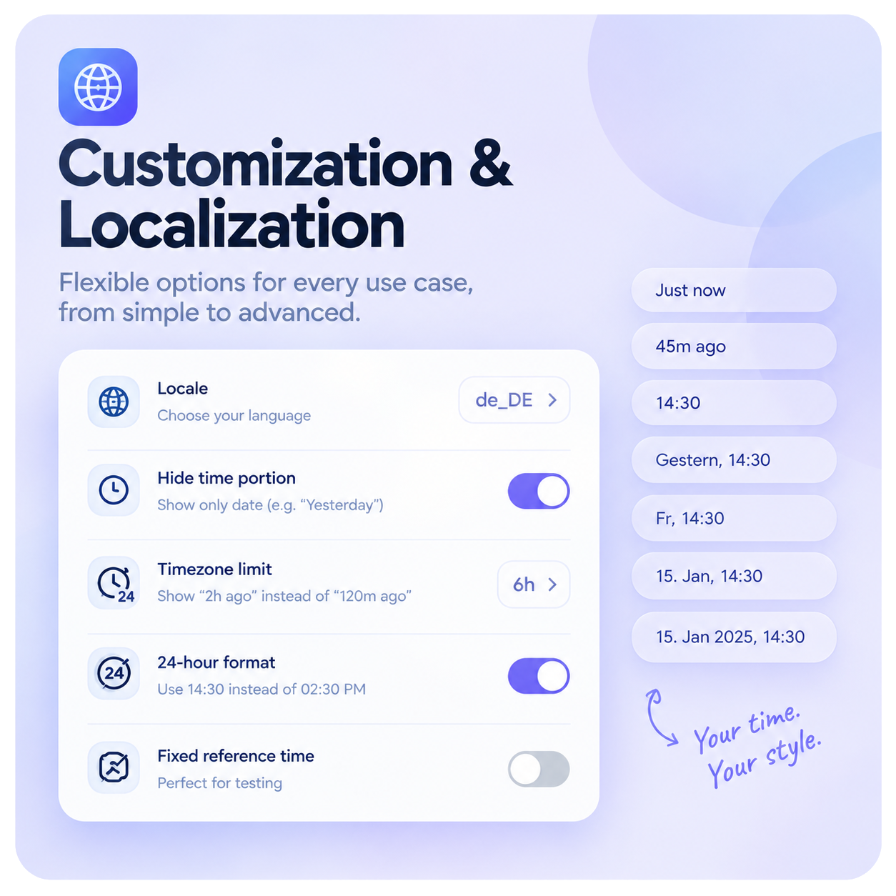

# flutter_timeago_pro

<p align="center">
  <a href="https://pub.dev/packages/flutter_timeago_pro"></a>
  <a href="LICENSE"></a>
  <a href="https://flutter.dev"></a>
  <br>
  <a href="https://codecov.io/gh/aslamambiloly/flutter_timeago_pro"></a>
  <a href="https://app.codacy.com/gh/aslamambiloly/flutter_timeago_pro/dashboard?utm_source=gh&utm_medium=referral&utm_content=&utm_campaign=Badge_grade"></a>
</p>

<p align="center">
  <a href="https://ko-fi.com/N7K021PF59"></a>
</p>


A Flutter extension that formats `DateTime?` values into **human-friendly, context-aware timestamps** — the way notification apps, chat apps, and social feeds actually show time.

Unlike packages that say *"48 hours ago"* or *"7 days ago"* forever, `flutter_timeago_pro` adapts intelligently based on how far in the past **or future** the date is:

<p align="center">
  
  
  

</p>


<div align="center">

| Age/Time | Output | Output when `showTimeForOveraged: false` |
|:---:|:---:|:---:|
| < 1 minute | `Just now` | `Just now` |
| < 1 hour (past) | `45m ago` | `45m ago` |
| < 1 hour (future) | `in 45m` | `in 45m` |
| Today | `02:30 PM` | `02:30 PM` |
| Yesterday | `Yesterday, 02:30 PM` | `Yesterday` |
| Tomorrow | `Tomorrow, 02:30 PM` | `Tomorrow` |
| 2–6 days ago | `Friday, 02:30 PM` | `Friday` |
| 2–6 days ahead | `Monday, 02:30 PM` | `Monday` |
| Same year, > 1 week | `15 Jan, 02:30 PM` | `15 Jan` |
| Different year | `15 Jan 2025, 02:30 PM` | `15 Jan 2025` |
| `null` | `Unknown time` | `Unknown time` |

</div>


## Why not `timeago` or `jiffy`?

Those packages are great but they keep emitting relative phrases (`"2 days ago"`, `"a week ago"`) no matter how old the date is. For notifications, chat bubbles, or feed items, showing *"a month ago"* is less useful than showing the actual date. `flutter_timeago_pro` switches to absolute dates exactly when relative labels stop being helpful.

## Getting started

Add to your `pubspec.yaml`:

```yaml
dependencies:
  flutter_timeago_pro: ^3.0.6
```

Then run:
```bash
flutter pub get
```

## Usage

```dart
import 'package:flutter_timeago_pro/flutter_timeago_pro.dart';

// Past dates:
final pastDate = DateTime.now().subtract(const Duration(minutes: 25));
Text(pastDate.toTimeagoFormat())
// → "25m ago"

// Future dates:
final futureDate = DateTime.now().add(const Duration(minutes: 45));
Text(futureDate.toTimeagoFormat())
// → "in 45m"
```

### Hide the time portion

```dart

dateTime.toTimeagoFormat(showTimeForOveraged: false);
// → "Friday" | "15 Jan" | "15 Jan 2024"
```

### Custom timeago limit

```dart
// Override the default 1-hour limit to 3 hours
dateTime.toTimeagoFormat(timeagoLimit: const Duration(hours: 3));
// Output for 2h 30m ago → "2h ago"
```

### 24-hour clock

```dart
dateTime.toTimeagoFormat(timePattern: 'HH:mm');
// → "14:30"
```

### Custom locale / i18n

```dart
const bahasa = TimestampLocale(
  justNow: 'Baru saja',
  yesterday: 'Kemarin',
  tomorrow: 'Besok',
  minutesAgoSuffix: 'm lalu',
  hoursAgoSuffix: 'j lalu',
  minutesFromNowPrefix: 'dalam ',
  hoursFromNowPrefix: 'dalam ',
  unknownTime: 'Waktu tidak diketahui',
);

dateTime.toTimeagoFormat(locale: bahasa);
```

### Testing / custom reference time

```dart
// Pass a fixed "now" so your widget tests are deterministic:
dateTime.toTimeagoFormat(
  referenceTime: DateTime(2024, 6, 15, 14, 30),
);
```

## API

### `toTimeagoFormat`

```dart
String toTimeagoFormat({
  bool showTimeForOveraged = true,
  TimestampLocale locale = const TimestampLocale(),
  String timePattern = 'hh:mm a',
  DateTime? referenceTime,
  Duration timeagoLimit = const Duration(hours: 1),
})
```

| Parameter | Type | Default | Description |
|---|---|---|---|
| `showTimeForOveraged` | `bool` | `true` | Append the time portion to the label |
| `locale` | `TimestampLocale` | English defaults | Customise "Just now", "Yesterday", etc. |
| `timePattern` | `String` | `'hh:mm a'` | Any `intl` `DateFormat` pattern |
| `referenceTime` | `DateTime?` | `DateTime.now()` | Anchor for relative comparison |
| `timeagoLimit` | `Duration` | `const Duration(hours: 1)` | Maximum age to show as "Xm/Xh ago" |

### `TimestampLocale`

```dart
const TimestampLocale({
  String justNow = 'Just now',
  String minutesAgoSuffix = 'm ago',
  String hoursAgoSuffix = 'h ago',
  String yesterday = 'Yesterday',
  String tomorrow = 'Tomorrow',
  String minutesFromNowPrefix = 'in ',
  String hoursFromNowPrefix = 'in ',
  String unknownTime = 'Unknown time',
});
```

## Contributing

PRs and issues are welcome! Please open an issue first for significant changes.


## License

Made with 💛 by [aslamambiloly](https://github.com/aslamambiloly) © 2026
